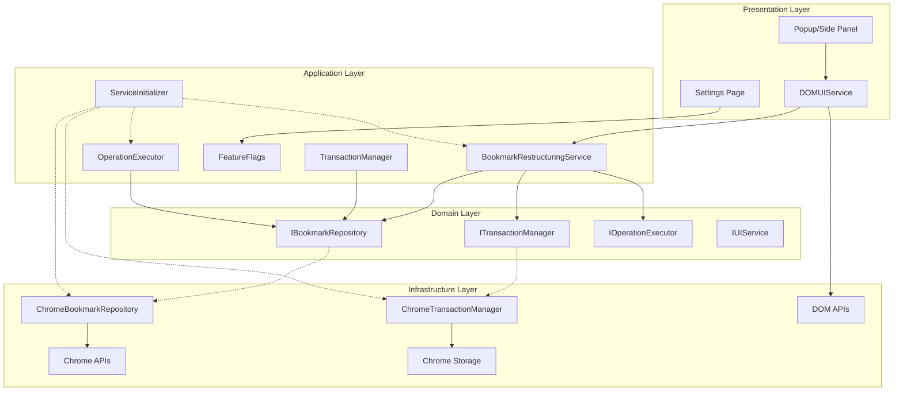
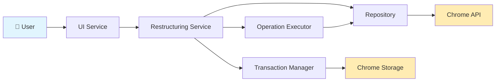
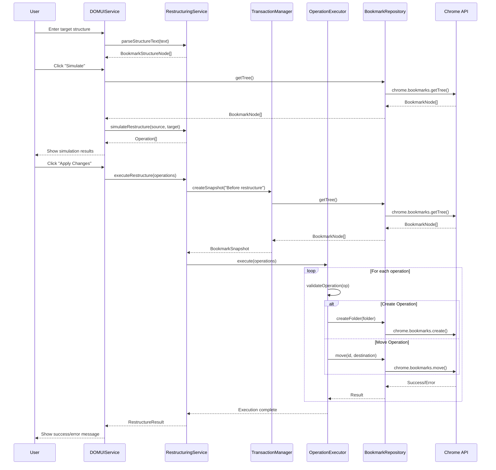
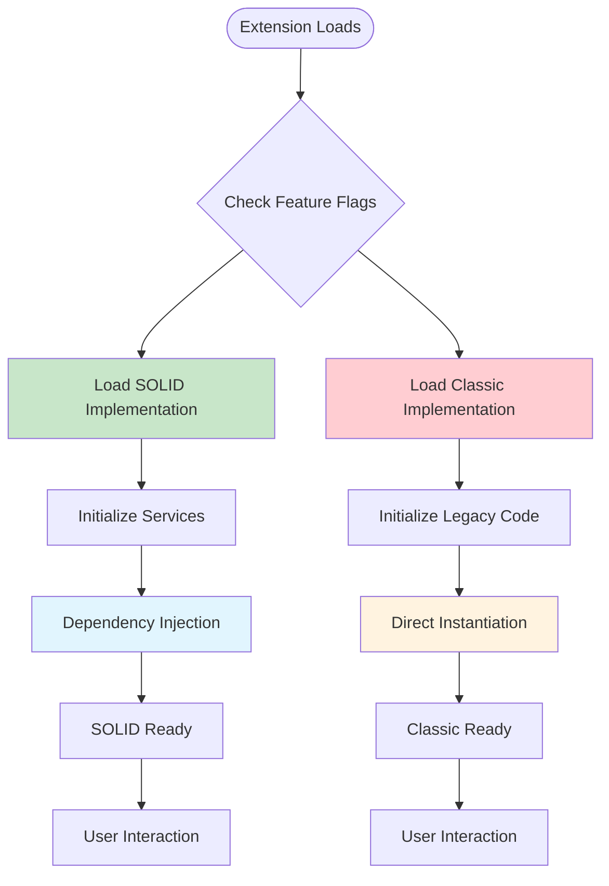
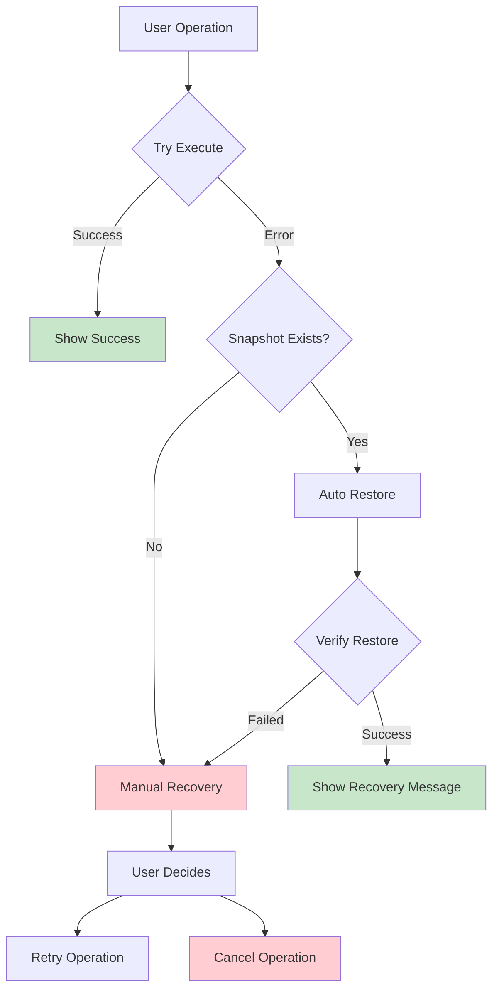
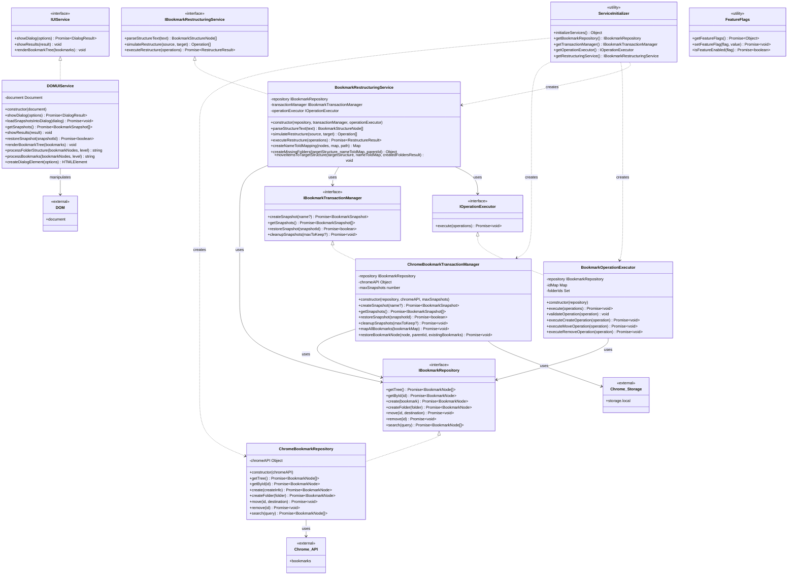

# Architecture Documentation

## Layered Architecture Overview

```mermaid
flowchart TD
    subgraph "Presentation Layer"
        UI[DOMUIService]
        Popup[Popup/Side Panel]
        Settings[Settings Page]
    end
    
    subgraph "Application Layer"
        RS[BookmarkRestructuringService]
        TM[TransactionManager]
        OE[OperationExecutor]
        SI[ServiceInitializer]
        FF[FeatureFlags]
    end
    
    subgraph "Domain Layer"
        IR[IBookmarkRepository]
        IT[ITransactionManager]
        IO[IOperationExecutor]
        IU[IUIService]
    end
    
    subgraph "Infrastructure Layer"
        CR[ChromeBookmarkRepository]
        CT[ChromeTransactionManager]
        Chrome[Chrome APIs]
        Storage[Chrome Storage]
        DOM[DOM APIs]
    end
    
    %% Layer Dependencies
    UI --> RS
    Popup --> UI
    Settings --> FF
    
    RS --> IR
    RS --> IT
    RS --> IO
    TM --> IR
    OE --> IR
    
    IR -.-> CR
    IT -.-> CT
    
    CR --> Chrome
    CT --> Storage
    UI --> DOM
    
    SI -.-> CR
    SI -.-> CT
    SI -.-> OE
    SI -.-> RS
```

## Simplified Component Interaction

```mermaid
graph LR
    User[👤 User] --> UI[UI Service]
    UI --> Core[Restructuring Service]
    Core --> Repo[Repository]
    Core --> Trans[Transaction Manager]
    Core --> Exec[Operation Executor]
    
    Repo --> Chrome[Chrome API]
    Trans --> Storage[Chrome Storage]
    Exec --> Repo
    
    style User fill:#e1f5fe
    style Chrome fill:#ffecb3
    style Storage fill:#ffecb3
```

## Bookmark Restructuring Sequence

```mermaid
sequenceDiagram
    participant User
    participant UI as DOMUIService
    participant RS as RestructuringService
    participant TM as TransactionManager
    participant OE as OperationExecutor
    participant Repo as BookmarkRepository
    participant Chrome as Chrome API
    
    User->>UI: Enter target structure
    UI->>RS: parseStructureText(text)
    RS-->>UI: BookmarkStructureNode[]
    
    User->>UI: Click "Simulate"
    UI->>Repo: getTree()
    Repo->>Chrome: chrome.bookmarks.getTree()
    Chrome-->>Repo: BookmarkNode[]
    Repo-->>UI: BookmarkNode[]
    
    UI->>RS: simulateRestructure(source, target)
    RS-->>UI: Operation[]
    UI-->>User: Show simulation results
    
    User->>UI: Click "Apply Changes"
    UI->>RS: executeRestructure(operations)
    
    RS->>TM: createSnapshot("Before restructure")
    TM->>Repo: getTree()
    Repo->>Chrome: chrome.bookmarks.getTree()
    Chrome-->>Repo: BookmarkNode[]
    Repo-->>TM: BookmarkNode[]
    TM-->>RS: BookmarkSnapshot
    
    RS->>OE: execute(operations)
    
    loop For each operation
        OE->>OE: validateOperation(op)
        alt Create Operation
            OE->>Repo: createFolder(folder)
            Repo->>Chrome: chrome.bookmarks.create()
        else Move Operation
            OE->>Repo: move(id, destination)
            Repo->>Chrome: chrome.bookmarks.move()
        end
        Chrome-->>Repo: Success/Error
        Repo-->>OE: Result
    end
    
    OE-->>RS: Execution complete
    RS-->>UI: RestructureResult
    UI-->>User: Show success/error message
```

## Feature Flag Decision Flow

```mermaid
flowchart TD
    Start([Extension Loads]) --> Check{Check Feature Flags}
    Check --> Solid[Load SOLID Implementation]
    Check --> Classic[Load Classic Implementation]
    
    Solid --> Init1[Initialize Services]
    Classic --> Init2[Initialize Legacy Code]
    
    Init1 --> DI[Dependency Injection]
    Init2 --> Direct[Direct Instantiation]
    
    DI --> Ready1[SOLID Ready]
    Direct --> Ready2[Classic Ready]
    
    Ready1 --> User1[User Interaction]
    Ready2 --> User2[User Interaction]
    
    style Solid fill:#c8e6c9
    style Classic fill:#ffcdd2
    style DI fill:#e1f5fe
    style Direct fill:#fff3e0
```

## Error Handling Flow

```mermaid
flowchart TD
    Operation[User Operation] --> Try{Try Execute}
    Try -->|Success| Success[Show Success]
    Try -->|Error| Snapshot{Snapshot Exists?}
    
    Snapshot -->|Yes| Restore[Auto Restore]
    Snapshot -->|No| Manual[Manual Recovery]
    
    Restore --> Verify{Verify Restore}
    Verify -->|Success| Recovered[Show Recovery Message]
    Verify -->|Failed| Manual
    
    Manual --> User[User Decides]
    User --> Retry[Retry Operation]
    User --> Cancel[Cancel Operation]
    
    style Success fill:#c8e6c9
    style Recovered fill:#c8e6c9
    style Manual fill:#ffcdd2
    style Cancel fill:#ffcdd2
```

```mermaid
classDiagram
    %% Interfaces (Abstract Layer)
    class IBookmarkRepository {
        <<interface>>
        +getTree() Promise~BookmarkNode[]~
        +getById(id) Promise~BookmarkNode~
        +create(bookmark) Promise~BookmarkNode~
        +createFolder(folder) Promise~BookmarkNode~
        +move(id, destination) Promise~void~
        +remove(id) Promise~void~
        +search(query) Promise~BookmarkNode[]~
    }
    
    class IBookmarkTransactionManager {
        <<interface>>
        +createSnapshot(name?) Promise~BookmarkSnapshot~
        +getSnapshots() Promise~BookmarkSnapshot[]~
        +restoreSnapshot(snapshotId) Promise~boolean~
        +cleanupSnapshots(maxToKeep?) Promise~void~
    }
    
    class IOperationExecutor {
        <<interface>>
        +execute(operations) Promise~void~
    }
    
    class IBookmarkRestructuringService {
        <<interface>>
        +parseStructureText(text) BookmarkStructureNode[]
        +simulateRestructure(source, target) Operation[]
        +executeRestructure(operations) Promise~RestructureResult~
    }
    
    class IUIService {
        <<interface>>
        +showDialog(options) Promise~DialogResult~
        +showResults(result) void
        +renderBookmarkTree(bookmarks) void
    }
    
    %% Concrete Implementations
    class ChromeBookmarkRepository {
        -chromeAPI Object
        +constructor(chromeAPI)
        +getTree() Promise~BookmarkNode[]~
        +getById(id) Promise~BookmarkNode~
        +create(createInfo) Promise~BookmarkNode~
        +createFolder(folder) Promise~BookmarkNode~
        +move(id, destination) Promise~void~
        +remove(id) Promise~void~
        +search(query) Promise~BookmarkNode[]~
    }
    
    class ChromeBookmarkTransactionManager {
        -repository IBookmarkRepository
        -chromeAPI Object
        -maxSnapshots number
        +constructor(repository, chromeAPI, maxSnapshots)
        +createSnapshot(name?) Promise~BookmarkSnapshot~
        +getSnapshots() Promise~BookmarkSnapshot[]~
        +restoreSnapshot(snapshotId) Promise~boolean~
        +cleanupSnapshots(maxToKeep?) Promise~void~
        +mapAllBookmarks(bookmarkMap) Promise~void~
        +restoreBookmarkNode(node, parentId, existingBookmarks) Promise~void~
    }
    
    class BookmarkOperationExecutor {
        -repository IBookmarkRepository
        -idMap Map
        -folderIds Set
        +constructor(repository)
        +execute(operations) Promise~void~
        +validateOperation(operation) void
        +executeCreateOperation(operation) Promise~void~
        +executeMoveOperation(operation) Promise~void~
        +executeRemoveOperation(operation) Promise~void~
    }
    
    class BookmarkRestructuringService {
        -repository IBookmarkRepository
        -transactionManager IBookmarkTransactionManager
        -operationExecutor IOperationExecutor
        +constructor(repository, transactionManager, operationExecutor)
        +parseStructureText(text) BookmarkStructureNode[]
        +simulateRestructure(source, target) Operation[]
        +executeRestructure(operations) Promise~RestructureResult~
        +createNameToIdMapping(nodes, map, path) Map
        +createMissingFolders(targetStructure, nameToIdMap, parentId) Object
        +moveItemsToTargetStructure(targetStructure, nameToIdMap, createdFoldersResult) void
    }
    
    class DOMUIService {
        -document Document
        +constructor(document)
        +showDialog(options) Promise~DialogResult~
        +loadSnapshotsIntoDialog(dialog) Promise~void~
        +getSnapshots() Promise~BookmarkSnapshot[]~
        +showResults(result) void
        +restoreSnapshot(snapshotId) Promise~boolean~
        +renderBookmarkTree(bookmarks) void
        +processFolderStructure(bookmarkNodes, level) string
        +processBookmarks(bookmarkNodes, level) string
        +createDialogElement(options) HTMLElement
    }
    
    %% Service Initializer (Factory Pattern)
    class ServiceInitializer {
        <<utility>>
        +initializeServices() Object
        +getBookmarkRepository() IBookmarkRepository
        +getTransactionManager() IBookmarkTransactionManager
        +getOperationExecutor() IOperationExecutor
        +getRestructuringService() IBookmarkRestructuringService
    }
    
    %% Feature Flags (Configuration)
    class FeatureFlags {
        <<utility>>
        +getFeatureFlags() Promise~Object~
        +setFeatureFlag(flag, value) Promise~void~
        +isFeatureEnabled(flag) Promise~boolean~
    }
    
    %% Relationships
    IBookmarkRepository <|.. ChromeBookmarkRepository
    IBookmarkTransactionManager <|.. ChromeBookmarkTransactionManager
    IOperationExecutor <|.. BookmarkOperationExecutor
    IBookmarkRestructuringService <|.. BookmarkRestructuringService
    IUIService <|.. DOMUIService
    
    %% Dependencies
    ChromeBookmarkTransactionManager --> IBookmarkRepository : uses
    BookmarkOperationExecutor --> IBookmarkRepository : uses
    BookmarkRestructuringService --> IBookmarkRepository : uses
    BookmarkRestructuringService --> IBookmarkTransactionManager : uses
    BookmarkRestructuringService --> IOperationExecutor : uses
    
    %% Service Initialization
    ServiceInitializer ..> ChromeBookmarkRepository : creates
    ServiceInitializer ..> ChromeBookmarkTransactionManager : creates
    ServiceInitializer ..> BookmarkOperationExecutor : creates
    ServiceInitializer ..> BookmarkRestructuringService : creates
    
    %% External Dependencies
    ChromeBookmarkRepository --> Chrome_API : uses
    ChromeBookmarkTransactionManager --> Chrome_Storage : uses
    DOMUIService --> DOM : manipulates
    
    class Chrome_API {
        <<external>>
        +bookmarks
    }
    
    class Chrome_Storage {
        <<external>>
        +storage.local
    }
    
    class DOM {
        <<external>>
        +document
    }
```