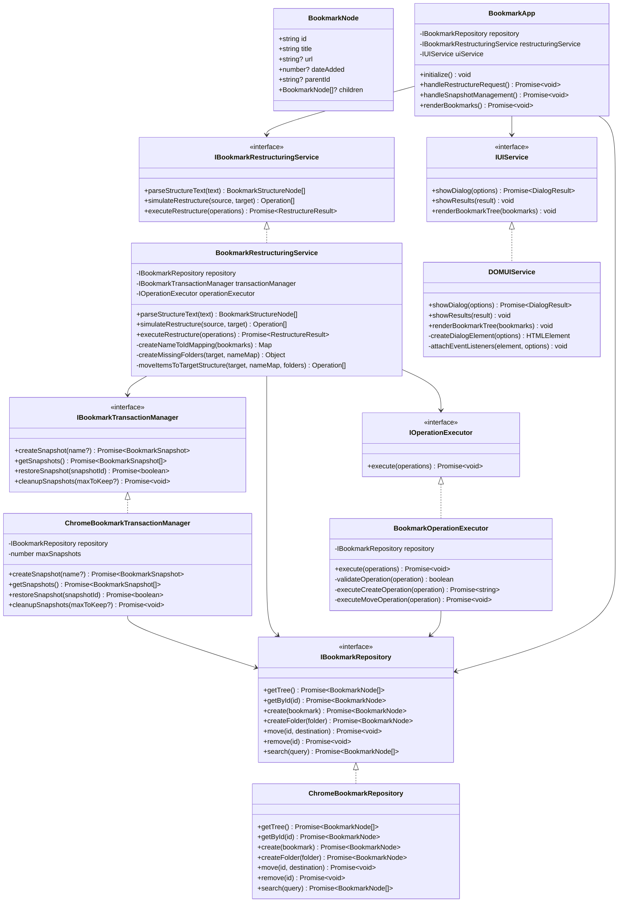
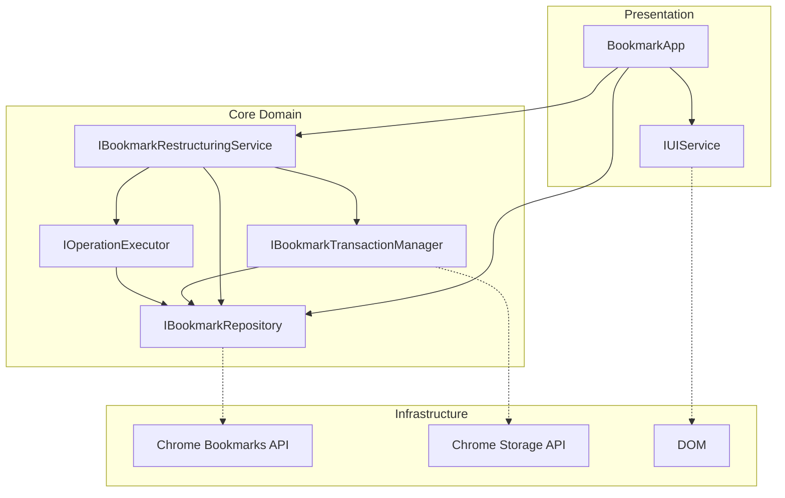
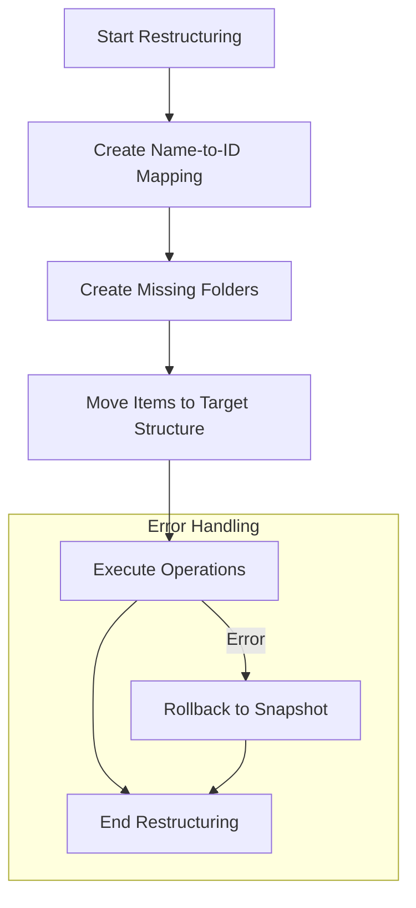
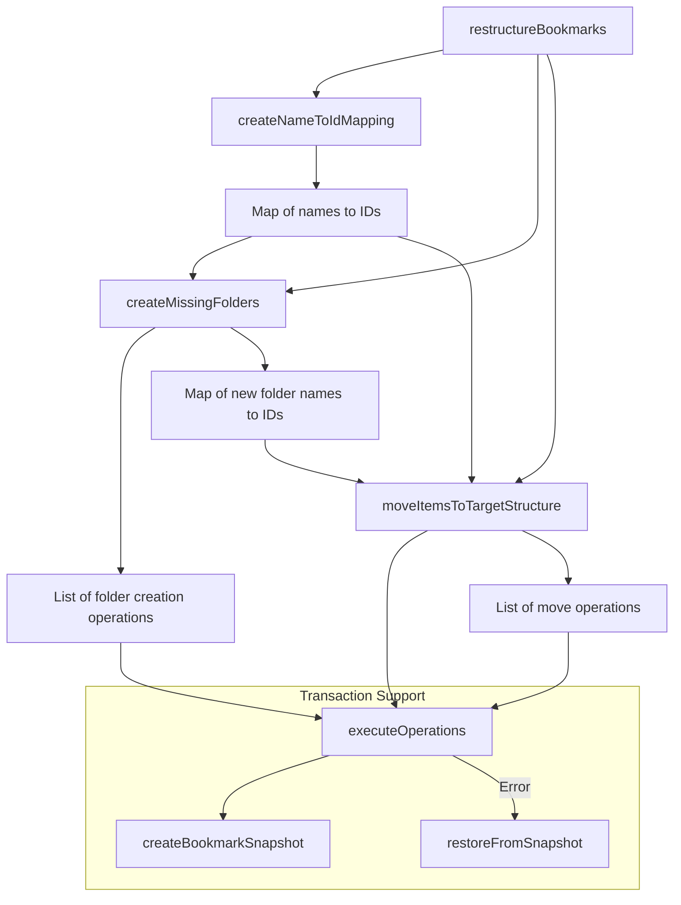
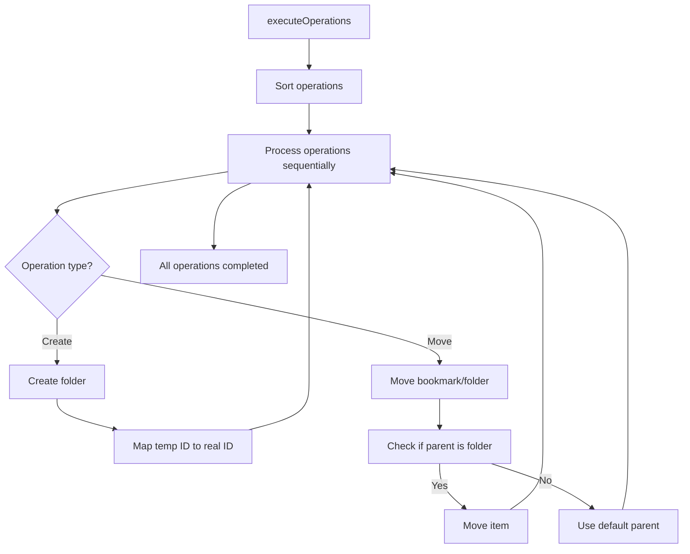
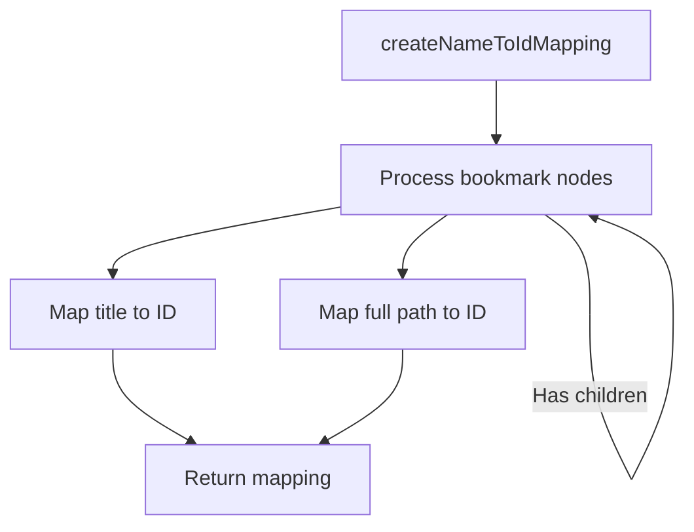
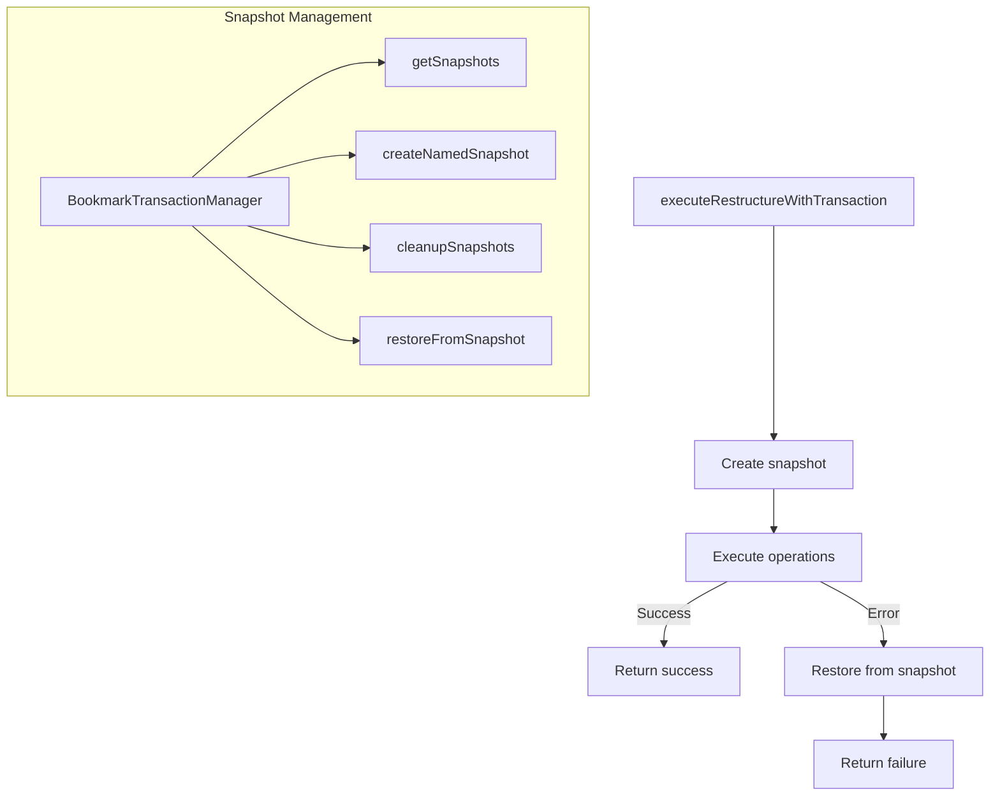

# Bookmark Lister Extension Specification

## Project Overview
A Chrome extension built with SvelteKit 5 that displays and manages Chrome bookmarks.

## API Contracts

### Chrome API Integration

#### Bookmark Service (`src/lib/services/bookmarkService.js`)

| Function | Parameters | Return Type | Description |
|----------|------------|-------------|-------------|
| `getBookmarks()` | None | `Promise<Array>` | Fetches the complete bookmark tree from Chrome |
| `deleteBookmark(id)` | `id: string` | `Promise<void>` | Deletes a bookmark by its ID |
| `createBookmark(title, url, parentId)` | `title: string, url: string, parentId?: string` | `Promise<BookmarkNode>` | Creates a new bookmark |
| `createFolder(title, parentId)` | `title: string, parentId?: string` | `Promise<BookmarkNode>` | Creates a new bookmark folder |
| `moveBookmark(id, destination)` | `id: string, destination: { parentId: string, index?: number }` | `Promise<void>` | Moves a bookmark to a different folder |
| `searchBookmarks(query)` | `query: string` | `Promise<Array<BookmarkNode>>` | Searches bookmarks by title or URL |

### Component Contracts

#### BookmarkItem (`src/lib/components/BookmarkItem.svelte`)

**Props:**
- `bookmark: BookmarkNode` - The bookmark data object
- `indent: number` - Indentation level for nested display

**Events:**
- `deleted` - Dispatched when a bookmark is deleted, with payload `{ id: string }`

#### FolderItem (`src/lib/components/FolderItem.svelte`)

**Props:**
- `folder: BookmarkNode` - The folder data object
- `indent: number` - Indentation level for nested display
- `expanded: boolean` - Whether the folder is expanded

**Events:**
- `toggle` - Event when folder is expanded/collapsed

### Data Types

#### BookmarkNode
```typescript
interface BookmarkNode {
  id: string;
  title: string;
  url?: string;
  dateAdded?: number;
  dateGroupModified?: number;
  parentId?: string;
  index?: number;
  children?: BookmarkNode[];
}
```

## SOLID Architecture

### Core Interfaces

#### IBookmarkRepository
```typescript
interface IBookmarkRepository {
  getTree(): Promise<BookmarkNode[]>;
  getById(id: string): Promise<BookmarkNode>;
  create(bookmark: { title: string, url?: string, parentId?: string }): Promise<BookmarkNode>;
  createFolder(folder: { title: string, parentId?: string }): Promise<BookmarkNode>;
  move(id: string, destination: { parentId: string, index?: number }): Promise<void>;
  remove(id: string): Promise<void>;
  search(query: string): Promise<BookmarkNode[]>;
  exists(id: string): Promise<boolean>;
  isFolder(id: string): Promise<boolean>;
}
```

#### IBookmarkTransactionManager
```typescript
interface IBookmarkTransactionManager {
  createSnapshot(name?: string): Promise<BookmarkSnapshot>;
  getSnapshots(): Promise<BookmarkSnapshot[]>;
  restoreSnapshot(snapshotId: string): Promise<boolean>;
  cleanupSnapshots(maxToKeep?: number): Promise<void>;
}
```

#### IBookmarkRestructuringService
```typescript
interface IBookmarkRestructuringService {
  parseStructureText(text: string): BookmarkStructureNode[];
  simulateRestructure(sourceStructure: BookmarkNode[], targetStructure: BookmarkStructureNode[]): Operation[];
  executeRestructure(operations: Operation[]): Promise<RestructureResult>;
}
```

#### IOperationExecutor
```typescript
interface IOperationExecutor {
  execute(operations: Operation[]): Promise<void>;
}
```

#### IUIService
```typescript
interface IUIService {
  showDialog(options: DialogOptions): Promise<DialogResult>;
  showResults(result: RestructureResult): void;
  renderBookmarkTree(bookmarks: BookmarkNode[]): void;
}
```

### Additional Data Types

```typescript
type Operation = {
  type: 'create' | 'move';
  id?: string;
  tempId?: string;
  folder?: { title: string, parentId: string };
  destination?: { parentId: string, index?: number };
};

type BookmarkSnapshot = {
  id: string;
  name?: string;
  timestamp: number;
  tree: BookmarkNode[];
};

type RestructureResult = {
  success: boolean;
  message: string;
  snapshotId?: string;
  operations?: Operation[];
};

type BookmarkStructureNode = {
  type: 'folder' | 'bookmark';
  title: string;
  url?: string;
  children?: BookmarkStructureNode[];
};

type DialogOptions = {
  type: 'organize' | 'results' | 'snapshot';
  title: string;
  content?: string;
  buttons: Array<{ id: string, text: string }>;
};

type DialogResult = {
  buttonId: string;
  data?: any;
};
```

### Architecture Diagram



### Dependency Flow Diagram



## Bookmark Restructuring Algorithm

The extension includes a powerful bookmark restructuring algorithm that allows users to reorganize their bookmarks according to a target structure. Below is a detailed analysis of how this algorithm works.

### Algorithm Overview



### Detailed Process Flow



### Operation Execution Flow



### Name-to-ID Mapping Process



### Error Handling and Recovery



### Key Algorithm Components

1. **Name-to-ID Mapping**: Creates a map of bookmark/folder names to their IDs for quick lookup
2. **Missing Folder Creation**: Identifies and creates folders that exist in the target structure but not in the current bookmarks
3. **Item Movement**: Moves bookmarks and folders to their new locations according to the target structure
4. **Transaction Support**: Creates snapshots before making changes and supports rollback in case of errors
5. **Error Handling**: Validates operations and provides fallbacks for invalid operations

### Common Issues and Solutions

| Issue | Solution |
|-------|----------|
| Invalid parent ID | Default to Bookmarks Bar ('1') |
| Duplicate folder names | Use full path for disambiguation |
| Temporary IDs | Map temporary IDs to real IDs after creation |
| Non-folder as parent | Check if ID is a folder before using as parent |
| Missing bookmarks | Skip move operations for non-existent items |


