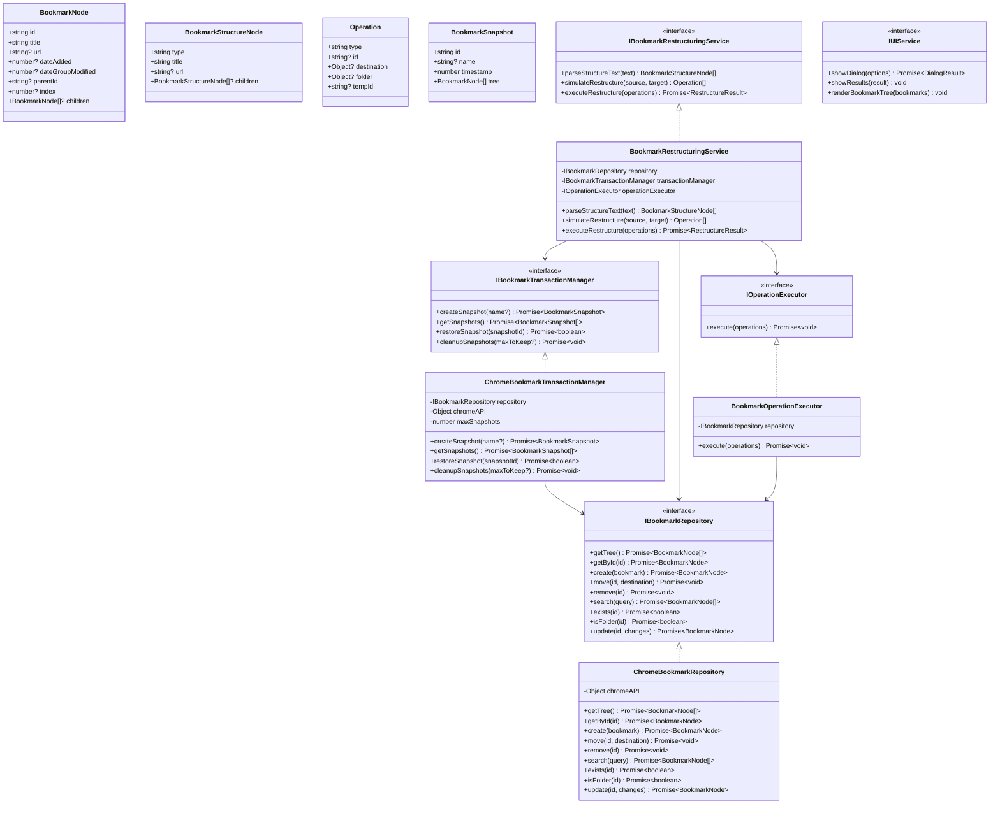
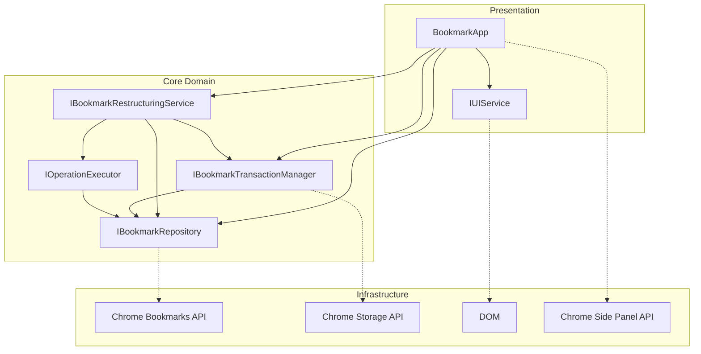

# Bookmark Lister Extension Specification

## Project Overview
A Chrome extension that displays and manages Chrome bookmarks.

## API Contracts

### Chrome API Integration

#### Bookmark Service (`src/lib/services/bookmarkService.js`)

| Function | Parameters | Return Type | Description |
|----------|------------|-------------|-------------|
| `getBookmarks()` | None | `Promise<Array>` | Fetches the complete bookmark tree from Chrome |
| `deleteBookmark(id)` | `id: string` | `Promise<void>` | Deletes a bookmark by its ID |
| `createBookmark(title, url, parentId)` | `title: string, url: string, parentId?: string` | `Promise<BookmarkNode>` | Creates a new bookmark |
| `createFolder(title, parentId)` | `title: string, parentId?: string` | `Promise<BookmarkNode>` | Creates a new bookmark folder |
| `moveBookmark(id, destination)` | `id: string, destination: { parentId: string, index?: number }` | `Promise<void>` | Moves a bookmark to a different folder |
| `searchBookmarks(query)` | `query: string` | `Promise<Array<BookmarkNode>>` | Searches bookmarks by title or URL |

### Component Contracts

## SOLID Architecture

### Core Interfaces

#### IBookmarkRepository
```typescript
interface IBookmarkRepository {
  getTree(): Promise<BookmarkNode[]>;
  getById(id: string): Promise<BookmarkNode>;
  create(bookmark: { title: string, url?: string, parentId?: string }): Promise<BookmarkNode>;
  createFolder(folder: { title: string, parentId?: string }): Promise<BookmarkNode>;
  move(id: string, destination: { parentId: string, index?: number }): Promise<void>;
  remove(id: string): Promise<void>;
  search(query: string): Promise<BookmarkNode[]>;
  exists(id: string): Promise<boolean>;
  isFolder(id: string): Promise<boolean>;
  update(id: string, changes: { title?: string, url?: string }): Promise<BookmarkNode>;
}
```

#### IBookmarkTransactionManager
```typescript
interface IBookmarkTransactionManager {
  createSnapshot(name?: string): Promise<BookmarkSnapshot>;
  getSnapshots(): Promise<BookmarkSnapshot[]>;
  restoreSnapshot(snapshotId: string): Promise<boolean>;
  cleanupSnapshots(maxToKeep?: number): Promise<void>;
}
```

#### IBookmarkRestructuringService
```typescript
interface IBookmarkRestructuringService {
  parseStructureText(text: string): BookmarkStructureNode[];
  simulateRestructure(sourceStructure: BookmarkNode[], targetStructure: BookmarkStructureNode[]): Operation[];
  executeRestructure(operations: Operation[]): Promise<RestructureResult>;
}
```

#### IOperationExecutor
```typescript
interface IOperationExecutor {
  execute(operations: Operation[]): Promise<void>;
}
```

#### IUIService
```typescript
interface IUIService {
  showDialog(options: DialogOptions): Promise<DialogResult>;
  showResults(result: RestructureResult): void;
  renderBookmarkTree(bookmarks: BookmarkNode[]): void;
  showSnapshotManager(): Promise<void>;
  showRestructuringDialog(): Promise<void>;
  showConfirmation(message: string, confirmText?: string, cancelText?: string): Promise<boolean>;
  showError(message: string): void;
  showSuccess(message: string): void;
}
```

### Additional Data Types

```typescript
type Operation = {
  type: 'create' | 'move';
  id?: string;
  tempId?: string;
  folder?: { title: string, parentId: string };
  destination?: { parentId: string, index?: number };
};

type BookmarkSnapshot = {
  id: string;
  name?: string;
  timestamp: number;
  tree: BookmarkNode[];
};

type RestructureResult = {
  success: boolean;
  message: string;
  snapshotId?: string;
  operations?: Operation[];
};

type BookmarkStructureNode = {
  type: 'folder' | 'bookmark';
  title: string;
  url?: string;
  children?: BookmarkStructureNode[];
};

type DialogOptions = {
  type: 'organize' | 'results' | 'snapshot';
  title: string;
  content?: string;
  buttons: Array<{ id: string, text: string }>;
};

type DialogResult = {
  buttonId: string;
  data?: any;
};
```

### Architecture Diagram



### Dependency Flow Diagram



## Migration Status

The extension is currently transitioning to a SOLID architecture. See `MIGRATION.md` for detailed status.

### Implementation Progress
| Component | Status | Tests |
|-----------|--------|-------|
| ChromeBookmarkRepository | Complete | ✅ |
| BookmarkTransactionManager | Complete | ✅ |
| BookmarkOperationExecutor | Complete | ✅ |
| BookmarkRestructuringService | Complete | ✅ |
| DOMUIService | Complete | ❌ |
| Background Service Worker | Complete | ❌ |
| Popup UI | Complete | ❌ |

### Current Architecture
- Parallel implementations (original and SOLID) are maintained
- Feature flags control which implementation is used
- Service Worker limitations are addressed with a minimal loader script

## Testing Strategy

### Testing Tools
| Tool | Purpose | Configuration |
|------|---------|--------------|
| Vitest | Unit and integration testing | `vitest.config.ts` |
| JSDOM | DOM environment for testing | Configured in Vitest |
| @vitest/coverage-v8 | Code coverage reporting | Configured in Vitest |

### Testing Approach
- **Unit Tests**: All service classes have comprehensive unit tests
- **Coverage Targets**: 80% statement, 70% branch, 80% function, 80% line coverage
- **Test Isolation**: Chrome API is mocked in `vitest.setup.ts`

### Running Tests
```bash
# Run all tests
npm run test

# Watch mode for development
npm run test:watch

# Generate coverage report
npm run test:coverage

# Run tests for a specific file
npm run test:file src/path/to/file.test.js
```

## Chrome Side Panel Integration

The extension supports Chrome's Side Panel API (Chrome 114+) to provide a persistent UI alongside web pages.

### Side Panel Configuration

**Manifest Configuration:**
```json
"side_panel": {
  "default_path": "popup.html"
},
"permissions": ["sidePanel", "tabs"]
```

**Service Worker Implementation:**
- Side panel can be toggled by clicking the extension icon
- Panel behavior is configured with `chrome.sidePanel.setPanelBehavior()`
- Panel visibility can be controlled per-tab with `chrome.sidePanel.setOptions()`

### User Experience
- Users can pin the side panel for persistent access
- The side panel remains open when navigating between tabs
- The extension UI adapts to the side panel's narrower width


